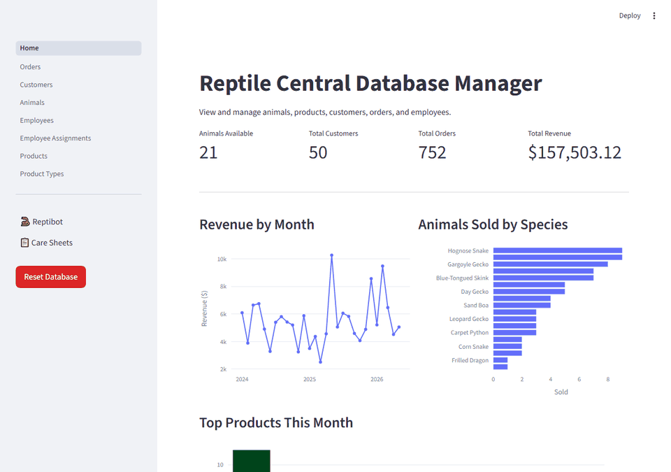

# Reptile Central Database

A full-stack CRUD web application for a fictional reptile-supply business, featuring
live animal inventory, customer and order management, employee tracking, and a
RAG-capable AI chatbot powered by GPT-4o mini and LlamaIndex.

**Stack:** Python · Streamlit · MySQL · SQLAlchemy · Pandas · LlamaIndex · Plotly · Pytest · Playwright · Google Cloud Run



The app is deployed on Google Cloud Run with a MySQL database hosted on Google Cloud SQL,
and is open for anyone to explore at:

[https://reptile-central-328698967588.us-central1.run.app/](https://reptile-central-328698967588.us-central1.run.app/)

*Note that AI chatbot usage is rate-limited to prevent abuse.*

## Motivation

This project was built to demonstrate Streamlit as an excellent choice for rapidly
prototyping and deploying full-stack internal business tools. Being Python-native means
CRUD interfaces come together quickly with tools like Pandas DataFrames, while AI
integration is painless using libraries like `LlamaIndex` for RAG. The project also
includes a full CI/CD pipeline via GitHub Actions, with end-to-end Playwright tests
running against a live Cloud SQL database on every push to `main`.

The same philosophy extends to deployment: Google Cloud's `gcloud` CLI made standing up
Cloud Run, Cloud SQL, and the pipeline itself surprisingly straightforward.

## Quick Start

**1. Clone the repo and install dependencies**

```bash
git clone https://github.com/BrandonConnely/Reptile-Central-Database.git
cd Reptile-Central-Database
pip install -r requirements.txt
```

**2. Set up the database**

Import `backend/sql_files/reptile_central_db.sql` into a running MySQL instance to
create the schema and seed data.

**3. Configure your credentials**

Create `.streamlit/secrets.toml`:

```toml
[mysql]
host     = "your-host"
port     = 3306
database = "your-database"
user     = "your-user"
password = "your-password"

[ai_mysql]
user     = "your-readonly-user"
password = "your-readonly-password"

[openai]
api_key  = "your-openai-api-key"
```

The `[ai_mysql]` block is a dedicated read-only MySQL user for the AI chatbot. Reptibot only needs `SELECT` access, so it gets its own restricted credentials to prevent prompt injection attacks. Create it and grant access:

```sql
CREATE USER 'bot'@'%' IDENTIFIED BY 'your-readonly-password';
GRANT SELECT ON your-database.* TO 'bot'@'%';
FLUSH PRIVILEGES;
```

**4. Run the app**

```bash
streamlit run frontend/Home.py
```

## Reptibot

Reptibot is the AI chatbot built into the app, powered by `GPT-4o mini` and `LlamaIndex`. It is capable of both answering questions using Retrieval-Augmented Generation (RAG) from the provided care sheet manuals, and translating natural language into SQL queries to answer questions about the live data (e.g. which customer has spent the most, which animals are currently available). Internally it uses a router to decide which kind of response is most appropriate for the given user input.


**Debug Mode**
Type `MOREINFO ON` into the chat to reveal the raw SQL query generated behind each
database answer. Type `MOREINFO OFF` to hide it.

## Usage

Navigate the sidebar to access each module of the app:

- **Dashboard** - live KPI metrics (animals available, total customers, orders, and revenue) with Plotly charts for revenue by month, animals sold by species, and top products this month
- **Orders** - create and manage multi-item orders across customers and products
- **Customers / Animals / Employees** - full CRUD for each entity
- **Employee Assignments** - link employees to the animals they are responsible for
- **Products / Product Types** - manage the product catalog and categories
- **Care Sheets** - browse species care guides with images and detailed manuals
- **Reptibot** - See above

A **Reset Database** button in the sidebar restores the database to its original seed state via a stored procedure, useful for demoing the app without worrying about polluting the data.

## Contributing

Contributions are welcome. To get started:

1. Fork the repo and create a branch from `main`
2. Follow the [Quick Start](#quick-start) guide to get a local instance running
3. Make your changes and ensure the app runs without errors
4. Open a pull request with a clear description of what you changed and why

For bugs or feature ideas, open an issue first so we can discuss before any work is done.

## Team

Built by Brandon Connely, Gage Cox, and Carlos Chirinos.
